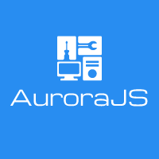

# AuroraJS

Bem-vindo ao incrível AuroraJS, uma ferramenta poderosa para desenvolvimento Node.js!



## Nota para a comunidade

### Hello, world!


#### Estamos na fase de criação do framework! A proposta é termos um framework mais objetivo, que facilite o desenvolvedor a implementar com um foco melhor no negócio/solução que ele pretende desenvolver
#### Resumindo, uma arquitetura de código que permita o desenvolvedor não se preocupar tanto com arquitetura do código e focar na solução

#### Obrigado!


## Instale as dependências

```
npm install
```

## Crie seu primeiro recurso com funções e chamadas padrão!

```
node resource.js nome-do-recurso
```

